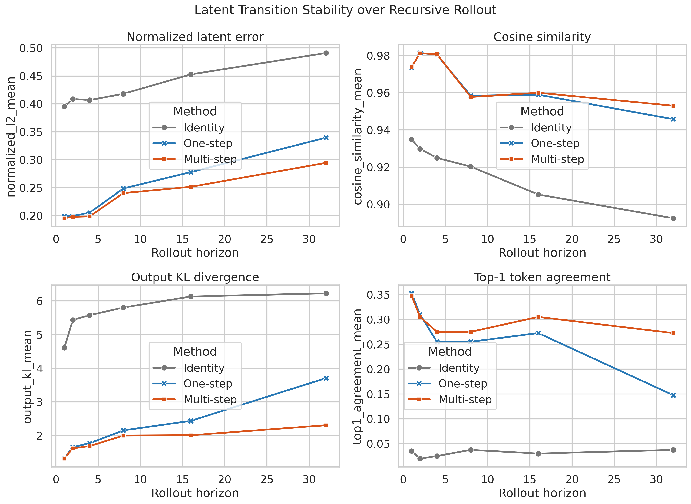
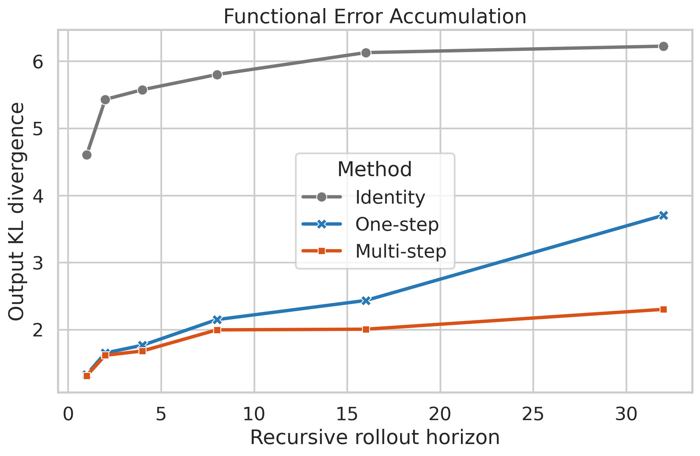
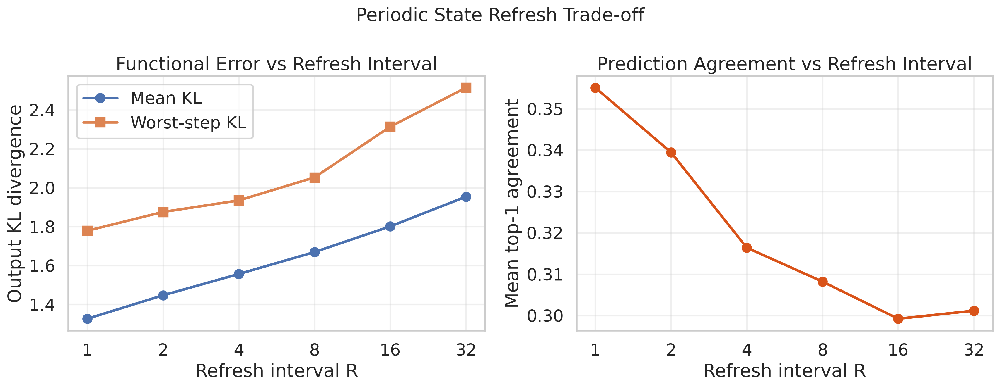
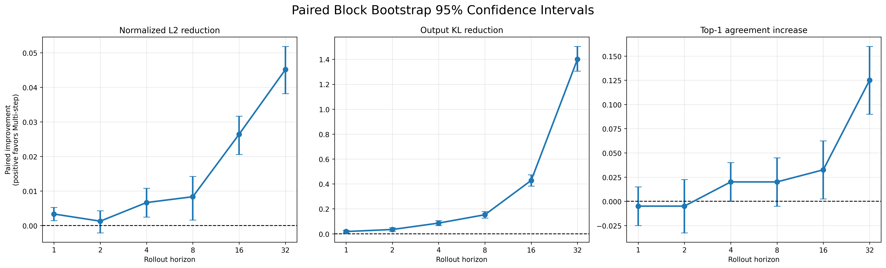

# Empirical Stability of Next-Latent Transitions

This project studies error accumulation in recursively predicted
language-model hidden states.

It was completed as part of the NUS MA2288 undergraduate research
project.

## Research question

Does low one-step latent prediction error guarantee stable recursive
rollout, and can multi-step supervision or periodic state refresh
control long-horizon error?

## Background

Next-Latent Prediction trains a latent transition operator

$$
\hat{h}_{t+1} = F_{\psi}\left(h_t, x_{t+1}\right)
$$

to predict the next hidden state from the current state and the next
observed token.

Under approximate transitions, recursive prediction may accumulate
error:

$$
e_{k+1} \leq \rho e_k + \epsilon_h
$$

This project empirically investigates that accumulation and evaluates
two error-control mechanisms:

1. multi-step supervision;
2. periodic teacher-state refresh.

## Experimental setup

- Frozen language model: DistilGPT-2
- Dataset: WikiText-2
- Hidden dimension: 768
- Transition model: residual two-layer MLP
- Training samples: 25,200 one-step transitions
- Test set: 80 text blocks
- Rollout horizons: 1, 2, 4, 8, 16, and 32
- Main metrics:
  - normalized latent L2 error;
  - hidden-state cosine similarity;
  - output-distribution KL divergence;
  - top-1 token agreement.

All latent rollouts use ground-truth future tokens, allowing latent
transition error to be studied separately from token-sampling error.

## Methods

### Identity baseline

The predicted future state is kept equal to the initial state:

$$
\hat h_{t+k} = h_t.
$$

### One-step transition

A residual MLP is trained using one-step Smooth L1 supervision:

```math
\hat{h}_{t+1}
=
h_t + f_{\psi}\left(
\operatorname{LN}\left[h_t; E\left(x_{t+1}\right)\right]
\right)
```

### Multi-step transition

The one-step model is fine-tuned using an eight-step recursive loss:

```math
L_{\mathrm{roll}}
=
\frac{1}{8}
\sum_{k=1}^{8}
\operatorname{SmoothL1}
\left(\hat{h}_{t+k}, h_{t+k}\right)
```

## Main results

The one-step transition substantially outperformed identity reuse at
every evaluated horizon. However, its error increased during recursive
rollout.

At horizon 32:

| Method | Normalized L2 | Output KL | Top-1 agreement |
|---|---:|---:|---:|
| Identity | 0.4910 | 6.2239 | 3.75% |
| One-step | 0.3394 | 3.7030 | 14.75% |
| Multi-step | 0.2943 | 2.3019 | 27.25% |

Compared with the one-step model, multi-step fine-tuning reduced
horizon-32 latent error by 13.29% and output KL by 37.84%, while
increasing top-1 agreement by 12.5 percentage points.



## Functional error accumulation

Although hidden-state cosine similarity remained high, output
distributions diverged substantially with rollout horizon. This shows
that geometric hidden-state similarity alone is not a sufficient
measure of functional prediction quality.



## Periodic refresh

Periodic replacement of predicted states with teacher states created a
clear refresh-frequency versus functional-error trade-off.

A refresh interval of four maintained worst-step output KL below 2.0
in this experiment while refreshing only one quarter of the positions.



The refresh fraction is a proxy for refresh frequency, not a measured
latency or computational-speedup result.

## Bootstrap analysis

Paired cluster bootstrap was performed over 80 test text blocks. At
horizon 32, multi-step fine-tuning reduced output KL by 1.401 on
average, with a 95% bootstrap confidence interval of
[1.306, 1.505].



## Conclusion

Low one-step latent error did not guarantee constant long-horizon
quality. The one-step transition remained better than identity reuse,
but its latent and functional errors accumulated during recursive
rollout.

Eight-step recursive supervision produced increasingly large benefits
at longer horizons, including horizons beyond the training rollout
length. Periodic state refresh provided an additional mechanism for
keeping output divergence within an explicit tolerance.

These results support the view that practical next-latent systems
should jointly control one-step approximation error, recursive
stability, and refresh frequency.

## Limitations

- Only DistilGPT-2 was evaluated.
- The language model was frozen rather than jointly trained with the
  transition model.
- Results currently use one transition-model training seed.
- Rollouts used ground-truth future tokens and therefore do not include
  free-running token-sampling error.
- Refresh frequency was measured, but actual inference latency and
  computational savings were not benchmarked.
- WikiText-2 is relatively small and may not represent long-context,
  dialogue, code, or retrieval workloads.

## Repository structure

```text
notebooks/
  01_environment_check.ipynb
  02_extract_hidden_states.ipynb
  03_prepare_dataset.ipynb
  04_identity_baseline.ipynb
  05_train_one_step_mlp.ipynb
  06_evaluate_rollout.ipynb
  07_train_multistep_mlp.ipynb
  08_compare_all_models.ipynb
  09_periodic_refresh.ipynb
  10_bootstrap_analysis.ipynb

results/
  figures/
  tables/

## Reference

This project is inspired by the following work:

Jayden Teoh, Manan Tomar, Kwangjun Ahn, Edward S. Hu, Tim Pearce,
Pratyusha Sharma, Akshay Krishnamurthy, Riashat Islam, Alex Lamb,
and John Langford.

**Next-Latent Prediction Transformers Learn Compact World Models.**
2026.

- Paper: https://arxiv.org/abs/2511.05963
- Official implementation: https://github.com/JaydenTeoh/NextLat
